# ContentGate product architecture

## Product boundary

ContentGate is a multi-tenant brand-content governance platform. It has one
internal control plane and one client workspace plane. A client workspace owns
its products, campaign definitions, approved knowledge, claims, assets,
template assignments, generated content, reviews, and exports.

The platform presents three product faces. These are experience boundaries,
not three interchangeable database roles.

| Product face | Primary people | Responsibilities | Authorization mapping |
| --- | --- | --- | --- |
| Platform operator | ContentGate owner and authorized platform staff | Qualify onboarding packages, provision client workspaces, inspect run receipts, and recover failed onboarding operations | Exact server-side operator email allowlist plus an authenticated account |
| Client administration | Client marketing, brand, legal, or compliance team | Manage the workspace, approve governed inputs, review content, administer users, and monitor campaign readiness | `admin`; optionally `approver` for decision-makers who must not receive workspace-management rights |
| Client user | Staff, field teams, agents, or distributors | Generate within approved campaigns, edit permitted fields, submit work, and use approved outputs | `member` |

`approver` is deliberately retained as a least-privilege permission role inside
the **client administration face**. It is not a fourth product face. An
`approver` can make review decisions but cannot manage products, sources,
assets, templates, or workspace membership. An `admin` can do both. Client UI
may label both experiences in client language while server checks continue to
enforce the narrower permission.

The operator capability is independent from `profiles.role`. It must never be
granted through client-editable profile data, JWT `user_metadata`, or a tenant
admin action. It is checked server-side before any control-plane operation.

## Trust and tenancy boundaries

- Every client-owned row carries `org_id`; row-level security and compound
  tenant foreign keys prevent cross-workspace access.
- Browser clients use the publishable Supabase key. The service-role key is
  server-only and is used only by reviewed control-plane operations.
- Documents, client assets, template bundles, and onboarding packages live in
  private storage with tenant- or operator-scoped paths and short-lived signed
  access.
- Approval and export are server-authoritative workflow transitions. UI
  visibility is helpful, but it is never the authorization boundary.
- Published template versions and approved content revisions are immutable.
  Revisions create new versions rather than rewriting the evidence behind an
  approval.

## Account recovery boundary

Password recovery is an authenticated server transition, not a client-side
dashboard redirect. The user starts at `/forgot-password`; Supabase sends the
transactional email through the verified Resend subdomain; and the recovery
template links to `/auth/confirm` with a one-time `token_hash`, `type=recovery`,
and the relative `/reset-password` destination. The server exchanges that hash
with `verifyOtp`, writes the recovery session to secure cookies, and only then
redirects to the password form. Saving the new password calls Supabase Auth's
authenticated user update and returns the user to the application.

The contract has these safety properties:

- the request screen always gives the same response, whether or not the email
  exists, so it does not disclose the account directory;
- recovery tokens are handled by Supabase, are time-limited and one-time, and
  never become application database credentials;
- the callback accepts only relative, same-origin destinations and falls back
  to a route appropriate to the verified OTP type;
- service-role and SMTP credentials remain server-side; browser code uses only
  the Supabase publishable key; and
- an expired or reused recovery link lands on a recoverable error state instead
  of silently entering an existing browser session or the dashboard.

The Resend sending identity is separate from the human Zoho mailbox. Resend
delivers automated account messages from
`accounts@notifications.contentgate.app`; Zoho receives and sends human support,
privacy, security, and billing mail on `contentgate.app`.

## New-client onboarding lifecycle

The client onboarding workflow starts before any asset is uploaded to
ContentGate. The ContentGate team and client first finalize the campaign and
its template contract. Only approved, implementation-ready material crosses
the platform intake boundary.

```mermaid
flowchart LR
  discovery["1. Campaign discovery"] --> design["2. Collaborative template design"]
  design --> signoff["Template contract sign-off"]
  signoff --> intake["3. Approved asset and knowledge intake"]
  intake --> package["4. Reviewed workspace package"]
  package --> preflight["5. Read-only preflight"]
  preflight --> staging["6. Provision staging workspace"]
  staging --> uat["7. Client admin and user acceptance"]
  uat --> production["8. Reviewed production launch"]
```

### 1. Campaign discovery

The ContentGate delivery team and client administration owner agree on:

- products, audiences, regions, languages, channels, and required formats;
- the campaign goal, approved message hierarchy, and review chain;
- who will be the initial client admin, optional approvers, and users;
- required source documents, claims, disclaimers, product imagery, logos,
  fonts, and usage rights; and
- launch acceptance criteria and the first real campaign used for testing.

The output is a named campaign brief, an accountable client owner, and an
asset/knowledge checklist. A vague or unsigned brief does not move into
template production.

### 2. Collaborative template design and sign-off

The team designs the campaign templates with the client in Figma or the agreed
design workflow before ingesting those assets into ContentGate. Assets may be
used as design references during collaboration, but they are not accepted into
the client workspace until the template contract is approved.

For each template family and format, the signed-off contract records:

- exact canvas dimensions and channel;
- the immutable reference design and the clean render background;
- locked brand elements versus editable text and image slots;
- semantic field keys, labels, and source (`ai`, `user`, `product`, or
  `locked`);
- bundled fonts, typography, alignment, and safe-area geometry;
- copy limits, line limits, minimum font sizes, and overflow behavior;
- required product, background, logo, packshot, or other asset slots; and
- representative default and worst-case copy fixtures.

Sign-off freezes the onboarding version. Later design changes become a new
immutable template version; they do not silently alter the version being
onboarded. This gate prevents asset intake and workspace setup from targeting a
moving design.

### 3. Approved asset and knowledge intake

After template sign-off, the client supplies the final material named by the
contract. Client administration confirms that each item is current, approved,
and licensed for the intended use. The ContentGate team maps it to stable
package keys rather than database IDs.

The intake includes, as applicable:

- product records and campaign metadata;
- approved source documents, claims, disclaimers, and brand guidance captured
  in those sources;
- logos, packshots, backgrounds, product imagery, fonts, and alt text;
- the initial user roster and least-privilege role mapping; and
- the signed-off portable template bundles.

Missing required material is reported against the checklist. The operator does
not compensate for missing approvals by inserting placeholders into a launch
package.

### 4. Reviewed workspace package

The delivery team assembles one ZIP with `blueprint.json` at its root and all
referenced files under relative paths. The blueprint contains stable workspace,
user, product, campaign, document, claim, asset, and template keys. The package
is the immutable handoff between delivery and platform operations.

At this boundary, **one click** becomes possible: preparation is complete, all
references are explicit, and the operator no longer edits SQL, source code, or
database UUIDs for each client.

### 5. Read-only preflight

The operator uploads the ZIP on the internal onboarding route. Preflight makes
no tenant writes. It validates the schema, cross-references, package paths,
file contents and checksums, image metadata, template manifests, fonts,
editable-slot contracts, copy fit, and scale guardrails. It displays counts and
an immutable SHA-256 digest for review.

Any error returns the package to delivery with a precise correction. The
operator cannot create a workspace from a failed or replaced preflight object.

### 6. Staging provisioning

After a clean preflight, the operator selects **Create workspace** in staging.
The provisioning saga creates the isolated organization, initial accounts,
products, campaigns, approved knowledge and claims, private assets, published
template versions, and product-template assignments. It emits a receipt with
resolved IDs and QA targets.

An identical retry is idempotent. A failed run compensates for partial Auth,
Storage, and database work. A changed package cannot mutate an existing
workspace under the current create-only contract.

### 7. Client acceptance

Acceptance uses at least two client perspectives:

1. A client admin confirms products, campaign names, sources, claims, assets,
   template references, formats, and review permissions.
2. A client user generates the first representative campaign, submits it, has
   it reviewed, and downloads only the approved revision.

The launch gate also covers keyboard and axe checks on the signed-in routes,
copy-fit fixtures, render dimensions, mobile/common-laptop behavior, signed URL
access, and cross-role negative tests. Any correction that changes package
content produces a new digest and a fresh staging workspace or an explicitly
reviewed migration—not an undocumented production edit.

### 8. Production launch and handoff

Production provisioning requires the reviewed package, a successful staging
receipt, named client owners, and the exact environment confirmation. The
operator provisions the workspace; the client admin completes account setup,
verifies the roster, and owns day-to-day governance. Client users then work only
within approved products, campaigns, knowledge, assets, and templates.

For the current create-only release, post-launch campaign or template changes
follow normal versioning and administration workflows. One-click reconciliation
of a changed package into a live tenant remains a separate feature because it
requires a change preview, field ownership rules, archival behavior, and a
rollback contract.

## Ownership and gates

| Gate | Accountable owner | Evidence required | Platform action enabled |
| --- | --- | --- | --- |
| Campaign ready | Client campaign owner | Approved brief, audiences, formats, review chain | Template work starts |
| Template ready | Client brand/marketing owner | Signed reference designs and editable-slot contract | Asset intake starts |
| Intake complete | Client admin + ContentGate delivery | Approved files, rights, knowledge, claims, roster | Package assembly starts |
| Package ready | ContentGate delivery | Review checklist and immutable ZIP | Operator preflight starts |
| Technical ready | Platform operator | Passing preflight and digest | Staging provisioning starts |
| Launch ready | Client admin + platform operator | Staging receipt, admin/user acceptance, QA results | Production provisioning starts |

These gates are intentionally human-readable. The platform automates repeatable
validation and provisioning, while named people remain accountable for campaign,
brand, legal, and launch decisions.

## Current scalability posture

- New client verticals are data and portable template bundles, not application
  code branches.
- Stable package keys remove manual database-ID coordination.
- Immutable template versions make client-specific changes auditable and
  rollbackable.
- Package preflight moves defects left, before tenant creation.
- Idempotent provisioning and run receipts make retries supportable.
- Tenant-scoped data, storage, and server-side authorization preserve isolation
  as the client count grows.

The current account model gives each profile one organization. Multi-workspace
membership, client self-service provisioning, and one-click reconciliation are
future architecture changes, not assumptions hidden in this onboarding flow.

## Related implementation contracts

- [One-click client onboarding](./ONE_CLICK_ONBOARDING.md) defines the package,
  safety, idempotency, and recovery contract.
- [Client onboarding runbook](./CLIENT_ONBOARDING_RUNBOOK.md) defines the
  human owners, handoffs, operator screens, acceptance checklist, and stop
  conditions.
- [Template Platform v1](./template-platform-v1.md) defines how signed-off
  Figma designs become portable, validated, immutable template versions.
- [Lifecycle action model](./ui-ux-master-plan/11-LIFECYCLE-ACTION-MODEL.md)
  defines the author, review, approval, and export transitions.
- [Accessibility standard](./accessibility.md) defines the automated and manual
  launch gates for the three faces.
- [End-to-end browser QA](./e2e-qa.md) defines the disposable password-recovery
  journey and its cleanup requirements.
