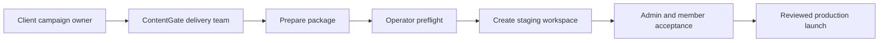

# Client onboarding runbook

## Purpose

This is the day-to-day operating procedure for adding a new ContentGate client.
It separates campaign preparation, package preparation, platform provisioning,
and client acceptance so that no one has to infer who owns the next step.

The three platform faces remain distinct:

1. **Platform operator** — ContentGate owner or authorized operations staff.
2. **Client admin/approver** — the client marketing and review team.
3. **Client member** — staff or distributors who generate and use approved content.

## The short version



The client does not send an arbitrary ZIP to platform operations. The client
supplies approved inputs. ContentGate delivery converts them into portable
templates and a reviewed package. The platform operator validates and provisions
that package.

## Owners and handoffs

| Stage | Accountable owner | Input | Output |
| --- | --- | --- | --- |
| Campaign definition | Client campaign owner | Goals, products, audiences, channels | Approved campaign brief |
| Template production | ContentGate delivery + client brand owner | Brief, brand system, reference assets | Signed template contract and portable bundles |
| Intake review | Client admin + ContentGate delivery | Approved sources, claims, assets, roster | Complete reviewed handoff |
| Package preparation | ContentGate delivery | Reviewed handoff | Immutable onboarding ZIP |
| Technical preflight | Platform operator | Onboarding ZIP | Passing digest or correction list |
| Staging creation | Platform operator | Passing preflight | Staging workspace and receipt |
| Acceptance | Client admin + representative member | Staging workspace | Signed launch acceptance |
| Production launch | Platform operator | Accepted staging receipt | Production workspace |

## Before the package builder

The delivery lead creates a client handoff folder in the approved internal
client workspace. It should contain only the current signed-off version of:

- campaign brief and named client owner;
- client admin, approver, and member roster with work email addresses;
- product names, approved descriptions, and required disclaimers;
- approved knowledge documents and exact approved claims;
- logo, packshot, background, image, and font files with usage rights;
- signed reference designs and the portable template bundle ZIPs; and
- the acceptance scenario: product, template, output size, question, and sample content.

Drafts, superseded files, unlicensed fonts, and placeholder claims do not enter
the handoff folder.

## Prepare the ZIP

An allowlisted operator or delivery lead opens **Platform → Client onboarding**
and uses the **Prepare** stage.

1. Enter the client workspace name, key, and industry.
2. Add the initial people and assign `admin`, `approver`, or `member`.
3. Add products and campaigns.
4. Attach approved sources or paste approved source text.
5. Add each approved claim and map it to the exact source paragraph.
6. Add approved assets, titles, types, product ownership, and alt text.
7. Add each portable template ZIP and choose its product assignments.
8. Enter the preparer and the client approval reference.
9. Confirm asset/font rights and template-contract sign-off.
10. Select **Build reviewed ZIP**.

The builder works in browser memory. It does not create a tenant or write client
records to Supabase. It produces:

```text
client-key-onboarding.zip
├── blueprint.json
├── PACKAGE_REVIEW.md
├── knowledge/
├── assets/
└── templates/
```

Download a copy into the approved handoff folder. The generated copy is also
selected automatically for technical preflight.

## Validate the ZIP

Select **Upload and preflight**. The browser uploads the ZIP directly into the
private, operator-scoped staging bucket using a short-lived signed token.
Preflight is read-only with respect to the client tenant.

Review:

- workspace key and target environment;
- user, product, campaign, source, claim, asset, and template counts;
- package digest;
- every blocking issue; and
- template manifest, asset, font, copy-fit, and assignment results.

If preflight fails, do not repair records manually in Supabase. Return to
**Prepare**, correct the handoff or template bundle, build a new ZIP, and run a
fresh preflight. A changed file produces a changed digest.

## Create staging

After a passing preflight, select **Create workspace** once. ContentGate then:

- reserves the workspace key and audit run;
- creates the initial Auth users through the protected provisioning handshake;
- uploads private documents, assets, and template files;
- creates the organization, products, campaigns, sources, claims, and metadata;
- imports, publishes, and assigns template versions;
- completes the immutable run receipt; and
- sends account-setup emails through the configured Supabase/Resend path.

Do not close the page while provisioning is active. If an identical package is
retried, ContentGate returns its existing completed receipt without creating a
duplicate workspace.

## Staging acceptance checklist

### Client admin

- Account setup completes through the one-time email link.
- Workspace, product, and campaign names are correct.
- User roles match the approved roster.
- Sources, claims, disclaimers, and approval states are correct.
- Assets and template variants match the signed references.
- The admin can review and approve but cannot access platform operations.

### Representative client member

- Account setup completes successfully.
- The member sees only their client workspace.
- The member can use approved knowledge and assets.
- The member generates the representative campaign and submits it for review.
- The member cannot approve their own work or access client-admin/platform controls.
- Only an approved revision can be exported.

### Platform operator

- Run receipt is complete and setup-email delivery is recorded.
- Signed-in accessibility checks pass for the four representative routes.
- Required output sizes render and copy fits at the reviewed laptop widths.
- Cross-role and cross-tenant negative checks pass.
- The client admin records staging acceptance.

## Production launch

Production is a separate reviewed action. It requires the exact accepted
package, staging receipt, named client owners, production feature gate, and exact
confirmation phrase. The feature gate is disabled again after the launch.

The initial release is create-only. A changed package cannot silently update an
existing workspace. Post-launch changes use the product, knowledge, asset, and
template versioning workflows until a separately reviewed reconciliation mode
exists.

## When to stop

Stop and return the package to delivery when:

- an approval owner or reference is missing;
- a claim cannot be tied to an approved source paragraph;
- asset or font usage rights are unclear;
- a template contract is still changing;
- the roster contains personal or shared credentials instead of named users;
- preflight reports a blocker;
- the workspace key already belongs to a different package; or
- staging acceptance changes the package contents.

The operator is accountable for safe provisioning, not for overriding client,
legal, brand, or campaign approvals.
