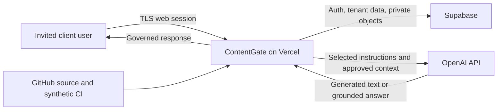

# ContentGate enterprise-beta assurance pack

Status date: August 1, 2026

Status: **Design-partner review draft — not yet approved**

This pack describes the controlled ContentGate enterprise beta and the
technical evidence available for review. It is not a SOC 2, ISO 27001, legal,
privacy, accessibility, penetration-testing, or service-level certification.
Unknown or unexercised controls are identified explicitly below.

The current certified application source is `602edbd`. It passed the exact
Preview provider-failure and stateful happy-path regressions and the full
remote release gate set. The later `606626d` commit changes only the CodeQL
workflow; its CodeQL, verify, clean-migration tenant-isolation, Preview E2E,
and Vercel gates all pass. This pack is documentation-only and does not turn
those engineering results into approval of the open owner-controlled gates.

## Service and beta scope

ContentGate is a multi-tenant brand-content governance service. Invited client
users create source-grounded marketing content inside an assigned workspace,
submit it for review, and export only an approved revision. The enterprise beta
is allowlisted, design-partner-specific, and manually governed. It does not
offer public signup or an unrestricted production SLA.

The beta includes:

- one isolated client workspace and an agreed Nimbus-based acceptance fixture;
- fixed `member`, `approver`, and `admin` roles;
- approved knowledge, assets, immutable template versions, generated drafts,
  revisioned review decisions, and approval-gated exports;
- tenant-scoped audit history and a bounded administrator CSV export;
- guarded customer-data export, legal hold, dual-approved deletion, and
  surviving deletion receipts; and
- release, rollback, health, capacity, and incident-response procedures.

## Architecture and data flow

Vercel runs the web application and server routes. Supabase provides Auth,
Postgres, the Data API, and private Storage. OpenAI receives only the selected
instructions and approved context needed for generation, Ask, import, or
embeddings. GitHub contains source and synthetic release evidence; customer
exports, customer secrets, and production credentials are prohibited there.

Supabase staging and production are in `ap-northeast-1`. The exact Vercel
function region, processor log retention, support-access model, and OpenAI data
control/transfer position must be approved in the processor schedule before a
partner is onboarded.

## Tenant isolation and authorization

- Every customer-owned database row carries an organization identifier.
- Row-level security, compound tenant foreign keys, private Storage prefixes,
  and server-side checks enforce workspace isolation.
- Browser sessions use the publishable Supabase key. Service credentials remain
  server-side and are limited to reviewed control-plane operations.
- Role and workspace membership are staged server-side before invitation and
  cannot be assigned through browser-controlled user metadata.
- Approval and export transitions are database-authoritative. Hiding a button
  is never treated as the authorization boundary.
- Published templates and approved content revisions are immutable; later
  changes create new evidence-bearing versions.

The permanent clean-migration CI gate builds all 93 migrations and exercises
two hostile tenants across database, Storage, API, and output boundaries.

## Identity and administrator security

Enterprise-beta users are invited; public signup is outside the product
contract. Administrators enroll TOTP MFA before a workspace's mandatory-admin
MFA control is enabled. When enabled, AAL1 administrators lose administrative
database capability and are redirected to MFA before the application shell.
Sensitive member administration and platform onboarding independently require
an AAL2 session.

Member disablement immediately removes database and Storage capability even if
an access token has not yet expired, then applies a Supabase Auth ban to block
fresh sign-in and refresh. Role change, disable, restore, invitation
cancellation, and MFA enablement create tenant audit receipts.

Password plus mandatory administrator MFA is the default beta identity model.
SAML/OIDC remains partner-dependent: if required by contract, that partner is
blocked until its IdP mapping, role behavior, deprovisioning, and non-SSO
break-glass administrator are tested and approved.

## Data inventory, retention, and deletion

The machine-checked inventory covers 29 tenant tables, Auth identities, five
private Storage buckets, derived knowledge/embedding records, review/export
history, and bounded operational telemetry. Infrastructure logs and backup
copies remain processor-controlled data and are not represented as part of the
live workspace export.

Proposed technical beta defaults are:

| Data class | Proposed default |
|---|---|
| Active workspace data | Retained while the beta workspace is active |
| Recoverable archived assets | 30 days |
| Ask operational records | 90 days, configurable from 30–3650 days |
| Onboarding package upload | Two hours maximum in the control plane |
| Workspace audit history | Retained with the active workspace |
| Global export/deletion receipts | Duration requires policy/legal approval |
| Infrastructure logs/backups | Approved processor retention schedule |

Customer export creates a mode-`0600` ZIP with a manifest, per-entry SHA-256
hashes, an archive hash, and a service-only receipt. It is bounded to 10,000
entries and 250 MiB of uncompressed data. Deletion requires a matching export,
different requester and approver, exact environment/workspace confirmation,
no legal hold, and a production change identifier. Database, Storage, and Auth
cleanup is fail-closed; a partial result is an incident, not success.

Deletion removes data from live systems. It does not rewrite immutable backup
copies; those age out under the approved processor retention schedule.

## Security evidence

Current candidate evidence includes:

- zero production dependency vulnerabilities from `npm audit`;
- GitHub CodeQL `security-extended` analysis for JavaScript/TypeScript with zero
  open alerts;
- Dependabot alerting enabled with zero open alerts;
- GitHub secret scanning with zero open alerts;
- Supabase security advisors with zero `ERROR` findings;
- reviewed authenticated `SECURITY DEFINER` warnings backed by explicit grants,
  tenant/role/AAL checks, bounded inputs, and negative tests;
- permanent two-tenant isolation, role lifecycle, MFA, audit-export, and
  data-lifecycle gates; and
- a controlled provider-failure gate proving bounded retries, safe responses,
  telemetry, and visible failure when incident routing is unconfigured.

These are internal and platform-automated controls. An independent scoped
security assessment remains required before the beta is described as having
independent security assurance. The reviewer scope should cover authentication
and recovery, authorization/RLS, Storage and signed URLs, server routes,
prompt/source handling, SSRF and upload parsing, tenant isolation, audit/export,
data lifecycle, secrets/logging, and deployment configuration. Every critical
or high finding must be closed or accepted in writing before client access.

## Availability, recovery, and incident response

The application exposes a health route covering database access, required
Storage buckets, worker liveness, and overdue media processing. Provider calls
use bounded attempts and safe retryable errors. Release and rollback procedures
name the exact deployment and prohibit blind database rollback.

The current Supabase Pro posture supports a daily database-backup assumption;
Storage object bytes are not included in database backups. No timed restore has
been completed, so no RTO/RPO is represented as achieved. The recommended beta
target—two-minute database RPO with PITR, 24-hour Storage RPO, one-hour
application RTO, and four-hour complete-service RTO—requires commercial and
owner approval plus a timed isolated restore drill.

The incident severity model and authenticated webhook implementation exist,
but a real destination, token, named incident owner, five-minute monitor, and
human acknowledgement/tabletop are not yet configured. A daily Vercel cron is
only a backstop and does not satisfy the five-minute target.

## Accessibility posture

The release gate covers every UI route with axe WCAG-oriented checks, names,
labels, headings, landmarks, keyboard sign-in and navigation, focus restoration,
320-CSS-pixel reflow, 200% zoom, reduced motion, and 44-by-44-pixel touch
targets. A representative Chrome accessibility-tree audit confirms one main
landmark, one page heading, named controls, and exposed live regions on
Dashboard, Ask, Assets, Reviews, and Studio.

This evidence does not replace a human assistive-technology walkthrough. An
accessibility reviewer must record pass/fail for reading order, context, status,
loading, asset picker, citations, review announcements, and task comprehension.
ContentGate must not claim WCAG certification from automated evidence alone.

## Subprocessors requiring contractual review

| Processor | Purpose | Open approval items |
|---|---|---|
| Vercel | Application hosting, server routes, logs, performance | Legal entity/DPA, function region, log retention, support access |
| Supabase | Database, Auth, Storage, API, backups | Legal entity/DPA, PITR/Storage recovery, retention, support access |
| OpenAI | Generation, Ask, import, embeddings | DPA/API data controls, model allowlist, transfer/region position |
| GitHub | Source control and CI | Access owner, Action/artifact retention, branch protection evidence |

The approved schedule must also name any email delivery, domain, monitoring,
or support processors used in the production configuration.

## Known beta limitations requiring written acceptance

- No SOC 2, ISO 27001, legal, privacy, accessibility, or penetration-testing
  certification is claimed.
- SSO is not included unless a design partner makes it a contractual gate.
- Backup/PITR and Storage recovery targets are proposed, not proven.
- A named incident route, responder, five-minute monitor, and tabletop are open.
- Human assistive-technology review is open.
- Processor DPAs, exact retention/regions, and privacy/legal approval are open.
- The export is a sequential maintenance-window snapshot, not a transactionally
  frozen database snapshot.
- Routine deletion retry/resume is not implemented; partial deletion becomes an
  incident-led reconciliation.
- The documented beta capacity envelope is evidence for a small controlled
  design partner, not a general-scale benchmark or contractual SLA.

## Design-partner acceptance record

Complete this section before granting client access.

| Decision | Named owner | Evidence/reference | Date |
|---|---|---|---|
| Client business owner accepts beta scope | **Open** |  |  |
| Client security/privacy owner accepts limitations | **Open** |  |  |
| ContentGate engineering incident owner | **Open** |  |  |
| ContentGate client-contact owner | **Open** |  |  |
| ContentGate go/no-go approver | **Open** |  |  |
| Retention/deletion policy owner | **Open** |  |  |
| Accessibility reviewer | **Open** |  |  |
| Independent security reviewer | **Open** |  |  |

Acceptance must name the exact release SHA, production deployment, workspace,
identity model, support hours, escalation channel, recovery limitation, and any
time-bounded exception. Production mutation remains a separate authorized
release action.

## Detailed technical records

- [Architecture](./ARCHITECTURE.md)
- [Enterprise identity and access](./ENTERPRISE_IDENTITY_AND_ACCESS.md)
- [Enterprise data inventory](./ENTERPRISE_DATA_INVENTORY.md)
- [Enterprise retention and deletion](./ENTERPRISE_RETENTION_AND_DELETION.md)
- [Reliability and incidents](./ENTERPRISE_RELIABILITY_AND_INCIDENTS.md)
- [Capacity evidence](./ENTERPRISE_BETA_CAPACITY.md)
- [Accessibility standard](./accessibility.md)
- [Production release runbook](./PRODUCTION_RELEASE_RUNBOOK.md)
- [Enterprise-beta acceptance](./ENTERPRISE_BETA_ACCEPTANCE.md)
