# Template Platform v1

ContentGate templates should be reusable product assets, not renderer branches. The v1 platform separates design, product assignment, generated copy, and rendered outputs so a new product template can be added without handwritten coordinates in application code.

## Target Flow

```mermaid
flowchart LR
  figma["Figma template set"] --> publisher["ContentGate Figma Publisher"]
  publisher --> bundle["Portable template bundle"]
  bundle --> validator["Validator and compiler"]
  validator --> version["Immutable template version"]
  version --> assignment["Product assignment"]
  assignment --> generate["Size-first generation"]
  generate --> render["Generic renderer"]
  render --> output["Preview, approval, export"]
```



## Bundle Contract

A template bundle is a folder with a `manifest.json`, bundled fonts, exported full-reference images, exported background-only images, and optional fixtures. The manifest schema is represented in [manifest.ts](</Users/debbiemelgarejo/Documents/Content Gate/contentgate/src/lib/template-platform/manifest.ts:1>).

Required principles:

- The bundle declares semantic fields such as `headline`, `cta`, or `hero_image`.
- Variants represent concrete sizes, like `square`, `story`, `leaderboard`, or `medium_rectangle`.
- Each variant declares only the slots visible in that size.
- Text slots reference a bundled font by key. No system font fallback is allowed at publication time.
- Original preview uses the full Figma reference export.
- Generated output uses the background-only export plus editable slots.
- The validator blocks missing assets, missing fonts, missing fields, invalid geometry, duplicate semantic keys, and unsupported schema versions.
- The publish-readiness gate blocks visually unsafe bundles before they can become `ready`.

Example bundle layout:

```text
contentgate-local-friendly-v1/
  manifest.json
  fonts/
    Inter-Regular.ttf
    Inter-SemiBold.ttf
    Inter-Bold.ttf
  variants/
    square/
      reference.png
      background.png
    story/
      reference.png
      background.png
  fixtures/
    default.json
    long-copy.json
```

## Database Model

The additive migration [template_platform_v1_foundation](</Users/debbiemelgarejo/Documents/Content Gate/contentgate/supabase/migrations/20260714183000_template_platform_v1_foundation.sql:1>) introduces:

- `template_families`: stable reusable template identities.
- `template_versions`: immutable published bundle snapshots.
- `template_variants`: one concrete size/channel per version.
- `template_assets`: background, reference, font, and image assets by hash.
- `product_template_assignments`: product-specific enablement, default payload, and generation profile.
- `template_import_runs`: validation/preflight history.
- `render_jobs`: deterministic render records with diagnostics and output paths.
- `generated_content.template_version_id` and `generated_content.template_variant_id`: pins approved work to the exact template used.

The old `product_templates.layout_key` path remains available during migration, but new templates should target this platform instead.

## Compiler Contract

The compiler in [compiler.ts](</Users/debbiemelgarejo/Documents/Content Gate/contentgate/src/lib/template-platform/compiler.ts:1>) validates a manifest and produces insert-ready rows for the v1 tables. It does not write to the database directly.

The compiler is responsible for:

- canonical `manifest_sha256` hashing;
- generated IDs for the family, version, variants, assets, and import run;
- `ready` template version rows only when validation has no errors;
- `field_keys` per variant from the slots actually visible in that size;
- variant-owned reference/background assets and version-owned font assets;
- safe storage paths under the importer-provided bundle prefix;
- a validation report that can be stored on both `template_versions` and `template_import_runs`.

The future admin/API import path should call the compiler first, upload assets to storage, then insert the returned rows in a transaction.

## Publish-Readiness Gate

Structural manifest validation is not enough. A bundle may be valid JSON and still produce broken client-facing layouts. The publish-readiness validator in [publish-readiness.ts](</Users/debbiemelgarejo/Documents/Content Gate/contentgate/src/lib/template-platform/publish-readiness.ts:1>) is the safety gate for new clients and templates.

A version cannot become `ready` unless it passes these checks:

- Figma-derived bundles include the source Figma file key.
- Every variant has a separate full-reference asset and clean generated-background asset.
- Reference/background assets are not the same key, path, or checksum.
- Reference/background assets declare usable dimensions at 1x, 2x, or 3x of the variant canvas.
- Reference/background assets declare image MIME types.
- Font definitions point to font assets, use real font file extensions, and match the bundled asset checksum.
- Every publishable variant exposes at least one editable slot.
- Text slots reference text-compatible fields and image slots reference image-compatible fields.
- Text slots declare bounded copy limits (`maxChars` or `maxWords`).
- Text slots can physically fit their declared `fontSize × lineHeight × maxLines`.
- `shrink_to_fit` text slots declare a positive `minFontSize`.

This is the piece that prevents adding a new client from becoming trial-and-error. A bad Figma export or unsafe slot geometry fails during import instead of surfacing later in Studio, approval, or export.

## Importer Contract

The importer in [importer.ts](</Users/debbiemelgarejo/Documents/Content Gate/contentgate/src/lib/template-platform/importer.ts:1>) wraps the compiler with the operational checks needed before persistence.

The importer is responsible for:

- reusing an existing `template_families.id` when the same `family_key` already exists;
- verifying every manifest asset has a supplied payload;
- hashing supplied asset bytes and rejecting checksum mismatches;
- uploading verified assets to the private `template-bundles` bucket;
- inserting the compiled rows only after all uploads succeed;
- recording failed import runs without creating template versions.

The importer uses an injected repository boundary. The production repository should implement the final insert as one transactional operation, either through a database RPC or server-side transaction-capable client. Tests use a fake repository so validation, upload ordering, and failure handling stay deterministic.

## Import API

The first admin import endpoint is `POST /api/template-bundles/import`.

Request shape:

```json
{
  "manifest": {},
  "storagePrefix": "template-bundles/contentgate-local-friendly/v1",
  "assets": [
    {
      "path": "variants/square/background.png",
      "contentType": "image/png",
      "dataBase64": "..."
    }
  ]
}
```

Only admins can call it. The route verifies the user, checks asset hashes through the importer, uploads files to `template-bundles`, persists the compiled rows through the Supabase repository, and returns the imported template version id plus variant ids.

Imported versions are left in `ready` status. An admin then publishes the immutable version with `POST /api/template-bundles/publish`:

```json
{
  "templateVersionId": "..."
}
```

After publishing, an admin can attach that version to a product with `POST /api/product-template-assignments`:

```json
{
  "productId": "...",
  "templateVersionId": "...",
  "defaultVariantKey": "square",
  "generationProfile": {},
  "defaultPayload": {}
}
```

The assignment endpoint validates that the product belongs to the current organization, the template version is published, and the default variant exists in the manifest.

## Local Bundle Preflight

Before a new client template is imported, run the same preflight locally against the exported bundle directory:

```bash
npm run template-platform:preflight-bundle -- ./path/to/client-template-v1
```

The bundle directory must contain `manifest.json` and every asset path declared in the manifest. Optional sample copy fixtures can be checked too:

```bash
npm run template-platform:preflight-bundle -- ./path/to/client-template-v1 \
  --sample ./path/to/client-template-v1/fixtures/default.json \
  --sample ./path/to/client-template-v1/fixtures/long-copy.json
```

This verifies:

- manifest structure;
- publish-readiness rules;
- asset files exist inside the bundle folder;
- asset checksums match the manifest;
- required sample fields are present;
- sample copy fits every declared variant.

Only bundles that pass local preflight should be imported, published, and assigned to products.

## Figma Publisher Contract

New templates should come from Figma metadata, not handwritten React branches. The publisher input is a plain JSON handoff from Figwright, the Figma plugin, or another exporter. It records:

- one template family and immutable version;
- bundled font files with checksums;
- each Figma frame/variant with exact canvas size;
- full reference export path;
- background-only export path;
- editable text/image layers with exact coordinates, dimensions, typography, color, and alignment.

Editable Figma layer names must include a `cg` annotation:

```text
Headline [cg:field=headline label="Headline" maxChars=64 maxLines=2 minFontSize=48 source=ai]
CTA [cg:field=cta label="CTA" maxChars=24 maxLines=1 source=user]
Hero Image [cg:field=hero_image type=image source=product]
```

Supported annotation keys:

- `field`: stable semantic field key. Required for editable layers.
- `label`: human-readable label.
- `type`: optional field type override, such as `text`, `image`, or `asset_choice`.
- `source`: `ai`, `user`, `product`, or `locked`.
- `maxChars` or `maxWords`: required for publishable text slots.
- `maxLines`: rendered line limit.
- `minFontSize`: enables shrink-to-fit and declares the smallest allowed font size.

The compiler in [figma-publisher.ts](</Users/debbiemelgarejo/Documents/Content Gate/contentgate/src/lib/template-platform/figma-publisher.ts:1>) converts this metadata into the same bundle manifest used by the importer. It blocks unsafe inputs before they become bundle folders:

- missing font assets for Figma text layers;
- missing reference/background image metadata;
- reused full-reference images as generated backgrounds;
- conflicting field annotations across variants.

To compile a publisher input into a preflighted bundle directory:

```bash
npm run template-platform:write-figma-publisher-bundle -- \
  ./path/to/publisher-input.json \
  ./.template-bundles/client-template-v1
```

The command writes `manifest.json`, copies the referenced font/image assets, runs local preflight, and verifies checksums. Use `--json` for machine-readable output or `--skip-preflight` only when debugging the exporter itself.

For the current ContentGate Figma file, Figwright can generate both Set A and Set B publisher inputs and bundles without using official Figma MCP quota:

```bash
npm run figwright:export-contentgate-bundles
```

That command reads exact Figma text geometry/typography through the local Figwright plugin, exports 2x full-reference and 2x background-only PNGs, then writes preflighted bundles under `.template-bundles/figwright-contentgate/`.

For local/demo setup, the ContentGate bundles can be installed with:

```bash
npm run template-platform:install-contentgate
```

If Supabase has not applied the Template Platform migrations yet, generate one paste-ready SQL file and run it in Supabase SQL Editor first:

```bash
npm run template-platform:write-migration-sql
```

This writes `.template-bundles/template-platform-migrations.sql`, combining:

- `supabase/migrations/20260714183000_template_platform_v1_foundation.sql`
- `supabase/migrations/20260714190000_template_bundle_storage.sql`

By default the script loads `.env.local`, resolves the first organization, finds the seeded `ContentGate` product, imports both ContentGate platform bundles if missing, publishes them, and upserts product assignments. Useful options:

```bash
npm run template-platform:install-contentgate -- --org-id <org-id>
npm run template-platform:install-contentgate -- --product-id <product-id>
npm run template-platform:install-contentgate -- --product-name "ContentGate"
npm run template-platform:install-contentgate -- --bundle-source figwright
npm run template-platform:install-contentgate -- --bundle-source legacy
npm run template-platform:install-contentgate -- --bundle-root ./.template-bundles/figwright-contentgate
npm run template-platform:install-contentgate -- --no-assign
npm run template-platform:install-contentgate -- --dry-run
```

The installer defaults to `--bundle-source auto`: it uses Figwright-exported bundle directories when present and falls back to the legacy in-code ContentGate bundle builder otherwise. The current Figwright exporter writes `figwright-v1` template versions so it can coexist with older `v1` imports and product assignments can be promoted explicitly.

## Version Lifecycle

Template versions move through:

```text
draft -> validating -> ready -> published -> retired
```

Published versions are immutable. A Figma update creates a new version, and product assignments promote or roll back explicitly. Existing generated content stays pinned to the version and variant it used.

## Size-First Generation

The user chooses the output size before generation. The app then prompts the model only for fields visible in that variant. This prevents one long payload from being forced into every unrelated canvas size.

The intended workflow is:

```text
Product -> Template -> Size -> Generate -> Edit -> Review -> Export
```

## Current ContentGate Font Policy

Current ContentGate template bundles use Inter. Future clients may bundle other approved fonts per template version, but the renderer must fail validation if a declared slot cannot be rendered with its bundled font.

## Implementation Phases

1. Foundation: ship schema, manifest types, validator, tests, and this contract.
2. Publisher: build the local Figma publisher that tags fields, exports full references, exports background-only images, and writes manifests.
3. Compiler: ingest a bundle into the new tables and fail publication on validation errors.
4. Renderer: render any bundle variant with the same engine, using bundled fonts and deterministic diagnostics.
5. ContentGate migration: import the two ContentGate families as real bundles using Inter and the existing Figma-derived backgrounds.
6. Studio/generation: switch generation to size-first and render/edit from manifest-defined fields.
7. Cleanup: retire `layout_key` renderer dispatch for migrated templates and remove legacy template-specific font dependencies.
